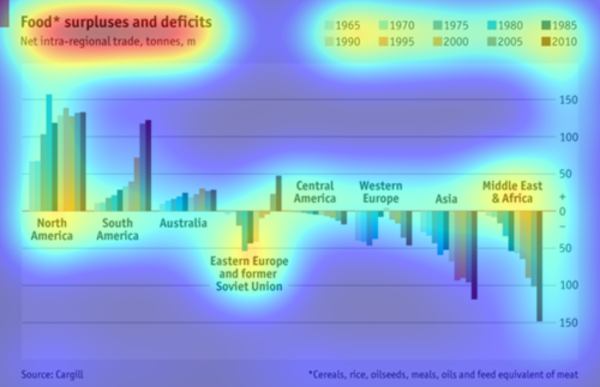

## PyTorch Implementation for 'Learning Visual Importance for Graphic Designs and Data Visualizations'

This repo implements training and testing models for [1] by PyTorch, and based on 
 [Caffe codes](https://github.com/cvzoya/visimportance) authors of [1] provide.

### Dataset

To download datasets, GDI (Graphic Design Importance) Dataset and Massvis (Visualization) Dataset,
see [authors' repo](https://github.com/cvzoya/visimportance/tree/master/data).

### Testing

Usage: 
```bash
python visimportance.py  --dataset <dataset_name>            # name of dataset, gdi or massvis (default: gdi)
                         --dataset_dir <directory_path>      # dataset directory
                         --fcn_type <fcn_type>               # FCN type, fcn32 or fcn16 (default: gdi)
                         --overlaid_img_dir <directory_path> # output directory path for images with heatpmap overlaid onto input images
                         --pretrained_model <file_path>      # pretrained model converted from Caffe models
                         --gpu <device_id>                   # GPU id (default: 0)
                         --eval_only                         # evaluation only
```
    
#### Pretrained models

The followings are PyTorch pretrained models. Specify the file path to `--pretrained_model` option.

* `gdi_fcn32.pth` FCN-32s model for GDI (Graphic Design Importance) Dataset, link(preparing)
* `gdi_fcn16.pth` FCN-16s model for GDI (Graphic Design Importance) Dataset, link(preparing)
* `massvis_fcn32.pth` FCN-32s model for Massvis (Visualization) Dataset, link(preparing)

These models are converted from [Caffe models](https://github.com/cvzoya/visimportance/tree/master/models) authors of [1] provide.

### training

Usage: 
```bash
python visimportance.py  --dataset <dataset_name>            # name of dataset, gdi or massvis (default: gdi)
                         --dataset_dir <directory_path>      # dataset directory
                         --fcn_type <fcn_type>               # FCN type, fcn32 or fcn16 (default: gdi)
                         --overlaid_img_dir <directory_path> # output directory path for images with heatpmap overlaid onto input images
                         --pretrained_model <file_path>      # pretrained model converted from Caffe models
                         --gpu <device_id>                   # GPU id (default: 0)
                         --resume <file_path>                # checkpoint file to be loaded when retraining models
                         --checkpoint_dir <directory_path>   # checkpoint file to be saved in each epoch
                         --config <configuration_id>         # configuration for training where several hyperparameters are defined
```

#### Pretrained models

The followings are PyTorch VOC FCN-32s pretrained model.
Specify the file path to `--pretrained_model` option when you newly start to train models for GDI/Massvis datasets.

* `voc_fcn32.pth` FCN-32s model for GDI (Graphic Design Importance) Dataset, link(preparing)

This model is converted from [Caffe models](https://github.com/cvzoya/visimportance/tree/master/models) authors of [1] provide.

## Examples

### GDI

* Ground truth


* Predicted by FCN-16s


### Massvis

* Ground truth



* Predicted by FCN-32s


## References

1. Zoya Bylinskii and Nam Wook Kim and Peter O'Donovan and Sami Alsheikh and Spandan Madan
   and Hanspeter Pfister and Fredo Durand and Bryan Russell and Aaron Hertzmann,
   Learning Visual Importance for Graphic Designs and Data Visualizations,
    Proceedings of the 30th Annual ACM Symposium on User Interface Software \& Technology, 2017.
     [site](http://visimportance.csail.mit.edu/)
